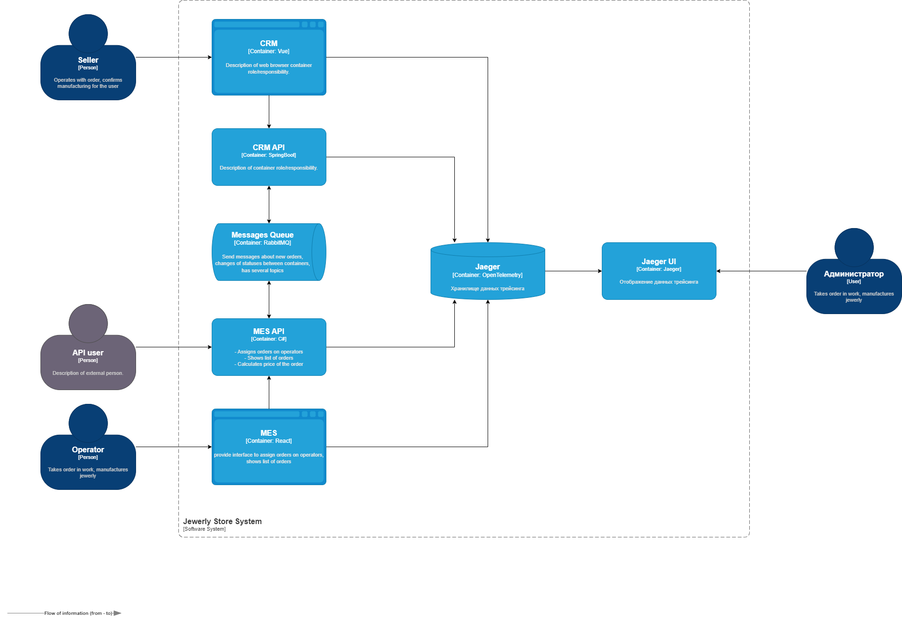
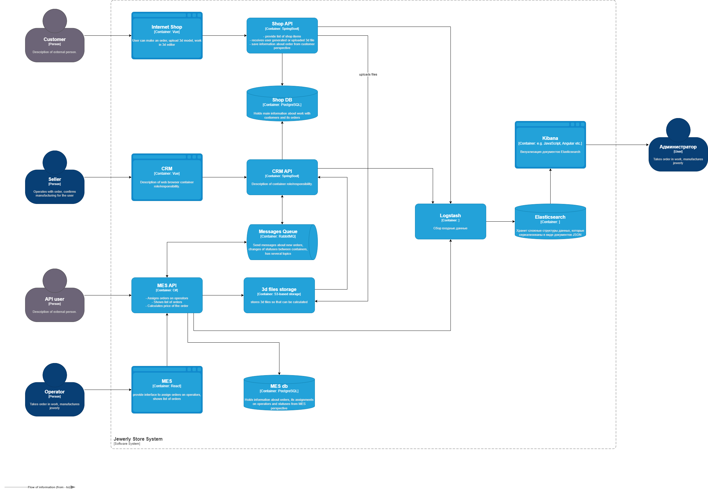

https://drive.google.com/drive/folders/1bKN5V22Pi_i0-_WgL9vaYtPAOOBj0IuA?usp=drive_link

# Задание 1. Анализ, идентификация проблем и решений, планирование

https://docs.google.com/document/d/19I-g_HGoQtsCeytaSAqCylKRLzWDdGoekocEaAJKfdw/edit?usp=sharing

## Исходная информация

MES (от англ. manufacturing execution system), система управления производственными процессами — специализированное
прикладное программное обеспечение, предназначенное для решения задач синхронизации, координации, анализа и оптимизации
выпуска продукции в рамках какого-либо производства. MES-системы относятся к классу систем управления уровня цеха, но
могут использоваться и для интегрированного управления производством на предприятии в целом.

CRM (CRM-система, сокращение от англ. Customer Relationship Management) — Система управления взаимоотношениями с
клиентами - прикладное программное обеспечение для
организаций, предназначенное для автоматизации стратегий
взаимодействия с заказчиками (клиентами), в частности, для повышения уровня продаж, оптимизации маркетинга и улучшения
обслуживания клиентов путём сохранения информации о клиентах и истории взаимоотношений с ними, установления и улучшения
бизнес-процессов и последующего анализа результатов.

Классификация логов: FATAL, ERROR, WARN, INFO, DEBUG, TRACE.

[Текущая архитектура](./jewerly_c4_model.drawio)

Акторы:

1. Покупатель (Customer)
2. Продавец (Seller)
3. Пользователь API (API User)

Статусная модель заказа:
INITIATED [онлайн-магазин] — пользователь завёл новый заказ или положил товары в пустую корзину.
FILE_UPLOADED [онлайн-магазин] — пользователь загрузил файл с 3D-моделью или создал его с помощью конструктора.
SUBMITTED [онлайн-магазин] — пользователь нажал на кнопку «Сделать заказ».
PRICE_CALCULATED [MES] — система посчитала стоимость заказа.
MANUFACTURING_APPROVED [CRM] — заказ подтверждён, его можно отдавать в производство.
MANUFACTURING_STARTED [MES] — оператор взял заказ в работу.
MANUFACTURING_COMPLETED [MES] — оператор выполнил заказ.
PACKAGING [MES] — оператор начал упаковывать заказ.
SHIPPED [MES] — заказ отправлен покупателю.
CLOSED [CRM] — заказ завершён. Он закрывается после получения сообщения от транспортной компании или вручную.

Расчёт стоимости в среднем занимает 2-3 минуты (до 30 минут).

## Проблемы

1. Система долго прогружается, когда операторы заходят на первую страницу MES.
2. Время отображение списка заказов велико, в том числе и при применении фильтрации по статусам.
3. Возникают неидентифицированные проблемы при использовании выставленного API
4. Возросла нагрузка на API MES после его публикации
5. Время исполнения заказов значительно увеличилось
6. Возросло количество багов уровня high или highest, что приводит к величению срока выпуска нового функционала
7. Shop API и CRM используют одну БД Shop DB

## Инициативы

1. Повысить наблюдаемость системы через внедрение мониторинга.
2. Установить причину проблем с заказами в распределенной системе через внедрение трейсинга.
3. Повысить информированность о работе системы, в частности при возникновении ошибок, через внедрение логирования
4. Повысить отзывчивать системы через применение кешированя

## План на полгода

1. Постоение мониторинга сервисов Internet Shop, Shop API, CRM, CRM API, MES API, MES и баз данных Shop
   DB и MES db, очередей Messages Queue
2. Внедрение трейсинга в тех элементах системы, через которые прохдит информация о заказе
3. Логирование в Internet Shop, Shop API, CRM, CRM API, MES API, MES
4. Кеширование информации (по заказам) в Shop API. Обосновние: решает проблему долгой загрузки страницы, несложная
   задача.

# Задание 2. Мониторинг

## Мотивация

Миниторинг повышает наблюдаемость системы, что дает следующие преимущества:

1. Повышение безопасности системы. Получая полное представление о работе системы, проще обеспечить безопасность.
2. Повышение надёжности системы. Мониторинг позволяет Быстрее определить корень проблемы, следовательно, так её проще
   устранить и ее предотвратить в будущем.
3. Повышение быстродействия системы. Выявление узких мест помогает оптимизировать производительность.
4. Ускорение рабочего процесса разработки и DevOps. Позволяет оптимизировать процессы и сокращает количества ошибок,
   что помогает ускорить процесс разработки и улучшить взаимодействие между командами.
5. Получение ценных бизнес-инсайтов. При наблюдении данные накапливаются и они могут привести к бизнес-инсайтам
   помогать принимать стратегические решения более обоснованно.
6. Повышение удовлетворённости пользователей. Своевременное решение проблем, которые связаны с производительностью и
   функциональностью приложения, улучшает пользовательский опыт.

## Выбор подхода к мониторингу

Метрики RED измеряют показатели, которые важны для конечных пользователей ваших сервисов. Этот подход можно использовать
для мониторинга веб-сервисов, запросов к базам данных, очередей асинхронного взаимодействия. При этом подходе
измеряются такие типы метрик как частота (Requests Rate) и длительность исполнения (Duration) запросов, а также
ошибки (Errors), возникающие при обработке запросов.

Метод USE более применим к ресурсам, производительность которых снижается при интенсивном использовании. К ним
относятся серверы и инструменты. При использовании этого метода измеряются такие типы метрик как уровень использовании
(Utilization) ресурсов, насыщенность (Saturation) в работе сервиса, которая приводит к накоплению очереди обработки, и
возникновение ошибок (Errors).

Какие метрики измерять для элементов системы указано в таблице 1. Метрики сгруппированы по методу, что будет
использовано для формирования дашбордов и настройке алертинга.

Таблица 1. Метрики контейнеров

| Контейнер        | Метрика                         | Метка | Тип           | Метод | Пояснение                                                                                     |
|------------------|---------------------------------|-------|---------------|-------|-----------------------------------------------------------------------------------------------|
| Messages Queue   | Number of "dead" letters        |       | Errors        | USE   | Измеряет количество повторно публикуемых сообщений. Накопление ошибок.                        |
| Messages Queue   | Number of message in flight     |       | Saturation    | USE   | Измеряет количество сообщений в пути. Насыщенность очереди                                    |
| Messages Queue   | CPU %                           |       | Utilization   | USE   | Процент использования процессора. Хватает ли вычислительных мощностей                         |
| Messages Queue   | Memory Utilisation              |       | Utilization   | USE   | Потребление оперативной памяти. Достаточно ли оперативной памяти                              |
|                  |                                 |       |               |       |
| Shop API         | RPS                             |       | Requests Rate | RED   | Скорость запросов. Определяем как часто происходят запросы                                    |
| Shop API         | Response time                   |       | Duration      | RED   | Длительность исполнения запроса. Насколько быстро отрабатывают запросы                        |
| Shop API         | Number of HTTP 4xx              |       | Errors        | RED   | Количество запросов с необработанной ошибкой. Насколько часто возникает необработанная ошибка |
|                  |                                 |       |               |       |                                                                                               |
| Shop API         | CPU %                           |       | Utilization   | USE   | Процент использования процессора. Хватает ли вычислительных мощностей                         |
| Shop API         | Memory Utilisation              |       | Utilization   | USE   | Потребление оперативной памяти. Достаточно ли оперативной памяти                              |
| Shop API         | Number of HTTP 2xx              |       | Traffic       | USE   | Количество успешных запросов. Насколько активно используется в штатном режиме                 |
| Shop API         | Number of simultaneous sessions |       | Saturation    | USE   | Количество одновременных подключений                                                          |
| Shop API         | Kb transferred (received)       |       | Traffic       | USE   | Объем получаемых данных. Определяет изменение объема данных от клиентов                       |
| Shop API         | Kb provided (sent)              |       | Traffic       | USE   | Объем отдаваемых данных. Определяет изменение объема данных для клиентов                      |
| Shop API         | Number of HTTP 5xx              |       | Errors        | USE   | Количество некорректных клиентских запросов. Насколько часто возникает необработанная ошибка  |
|                  |                                 |       |               |       |                                                                                               |
| CRM API          | RPS                             |       | Requests Rate | RED   | Скорость запросов. Определяем как часто происходят запросы                                    |
| CRM API          | Response time                   |       | Duration      | RED   | Длительность исполнения запроса. Насколько быстро отрабатывают запросы                        |
| CRM API          | Number of HTTP 4xx              |       | Errors        | RED   | Количество запросов с необработанной ошибкой. Насколько часто возникает необработанная ошибка |
|                  |                                 |       |               |       |                                                                                               |
| CRM API          | CPU %                           |       | Utilization   | USE   | Процент использования процессора. Хватает ли вычислительных мощностей                         |
| CRM API          | Memory Utilisation              |       | Utilization   | USE   | Потребление оперативной памяти. Достаточно ли оперативной памяти                              |
| CRM API          | Number of HTTP 2xx              |       | Traffic       | USE   | Количество успешных запросов. Насколько активно используется в штатном режиме                 |
| CRM API          | Number of simultaneous sessions |       | Saturation    | USE   | Количество одновременных подключений                                                          |
| CRM API          | Kb transferred (received)       |       | Traffic       | USE   | Объем получаемых данных. Определяет изменение объема данных от клиентов                       |
| CRM API          | Kb provided (sent)              |       | Traffic       | USE   | Объем отдаваемых данных. Определяет изменение объема данных для клиентов                      |
| CRM API          | Number of HTTP 5xx              |       | Errors        | USE   | Количество некорректных клиентских запросов. Насколько часто возникает необработанная ошибка  |
|                  |                                 |       |               |       |                                                                                               |
| MES API          | RPS                             |       | Requests Rate | RED   | Скорость запросов. Определяем как часто происходят запросы                                    |
| MES API          | Response time                   |       | Duration      | RED   | Длительность исполнения запроса. Насколько быстро отрабатывают запросы                        |
| MES API          | Number of HTTP 4xx              |       | Errors        | RED   | Количество запросов с необработанной ошибкой. Насколько часто возникает необработанная ошибка |
|                  |                                 |       |               |       |                                                                                               |
| MES API          | CPU %                           |       | Utilization   | USE   | Процент использования процессора. Хватает ли вычислительных мощностей                         |
| MES API          | Memory Utilisation              |       | Utilization   | USE   | Потребление оперативной памяти. Достаточно ли оперативной памяти                              |
| MES API          | Number of HTTP 2xx              |       | Traffic       | USE   | Количество успешных запросов. Насколько активно используется в штатном режиме                 |
| MES API          | Number of simultaneous sessions |       | Saturation    | USE   | Количество одновременных подключений                                                          |
| MES API          | Kb transferred (received)       |       | Traffic       | USE   | Объем получаемых данных. Определяет изменение объема данных от клиентов                       |
| MES API          | Kb provided (sent)              |       | Traffic       | USE   | Объем отдаваемых данных. Определяет изменение объема данных для клиентов                      |
| MES API          | Number of HTTP 5xx              |       | Errors        | USE   | Количество некорректных клиентских запросов. Насколько часто возникает необработанная ошибка  |
|                  |                                 |       |               |       |                                                                                               |
| Shop DB          | Memory Utilisation              |       | Utilization   | USE   | Потребление оперативной памяти. Достаточно ли оперативной памяти                              |
| Shop DB          | Number of connections           |       | Saturation    | USE   | Количество одновременных подключений. Одновременное использование базы данных                 |
| Shop DB          | Size of instance                |       | Utilization   | USE   | Размер базы данных                                                                            |
| Shop DB          | xact_rollback                   |       | Errors        | USE   | Количество откатов и ошибок при транзакциях. Позволит обнаружить ошибки в запросах            |
|                  |                                 |       |               |       |                                                                                               |
| MES DB           | Memory Utilisation              |       | Utilization   | USE   | Потребление оперативной памяти. Достаточно ли оперативной памяти                              |
| MES DB           | Number of connections           |       | Saturation    | USE   | Количество одновременных подключений. Одновременное использование базы данных                 |
| MES DB           | Size of instance                |       | Utilization   | USE   | Размер базы данных                                                                            |
| MES DB           | xact_rollback                   |       | Errors        | USE   | Количество откатов и ошибок при транзакциях. Позволит обнаружить ошибки в запросах            |
|                  |                                 |       |               |       |                                                                                               |
| 3d files storage | Size of storage                 |       | Utilization   | USE   | Размер хранилища                                                                              |
|                  |                                 |       |               |       |                                                                                               |

## План действий

1. Развернуть или инталлировать экпортер Prometheus для Shop API с метками из таблицы 1.
2. Развернуть или инталлировать экпортер Prometheus для MES API с метками из таблицы 1.
3. Развернуть или инталлировать экпортер Prometheus для CRM API с метками из таблицы 1.
4. Развернуть или инталлировать экпортер Prometheus для Shop DB с метками из таблицы 1.
5. Развернуть или инталлировать экпортер Prometheus для MES DB с метками из таблицы 1.
6. Развернуть или инталлировать экпортер Prometheus для 3d files storage с метками из таблицы 1.
7. Развернуть или инталлировать экпортер Prometheus для Messages Queue с метками из таблицы 1.
8. Развернуть инстанс Prometheus для получения временных рядов из экпортеров (пп 1-7)
9. Развернуть инстанс Grafana для визуализации временных рядов из Prometheus
10. Настроить дашборд для Shop API для метода USE (см таблицы 1)
11. Настроить дашборд для Shop API для метода RED (см таблицы 1)
12. Настроить дашборд для Shop MES для метода USE (см таблицы 1)
13. Настроить дашборд для Shop MES для метода RED (см таблицы 1)
14. Настроить дашборд для Shop CRM для метода USE (см таблицы 1)
15. Настроить дашборд для Shop CRM для метода RED (см таблицы 1)
16. Настроить дашборд для Shop DB (см таблицы 1)
17. Настроить дашборд для MES DB (см таблицы 1)
18. Настроить дашборд для 3d files storage (см таблицы 1)
19. Настроить дашборд для Messages Queue (см таблицы 1)

# Задание 3. Трейсинг

## Покрытие трейсингом

При определенных действиях над заказом заказ транслируется через определенные элементы системы. Например:

1. При создании заказа или изменение статуса заказа заказ транслируется через CRM API > Messages Queue > MES API > MES
2. При назначении оператора и присвоении заказу его стоимости путь следующий MES > MES API > Messages Queue > CRM API

При возникновении проблем в каком либо компоненте вдоль этого пути заказ может задерживаться или "зависать", что
становится причиной проблем со своевременным получением заказа.

Для того чтобы определить причины проблем со скоростью обработки заказов, необходимо настроить трейсинг.

## Мотивация

Трейсинг дает более быстрый и дешевый (с точки зрения требуемых ресурсов и затрат на поиск причины проблемы)
способ выяснить причину проблемы и контекст ее возникновения. Относительная дешевизна обусловлена тем, что не
нужно подробного логирования каждого элемента системы, которое требует содержать хранилище данных, а также тем, что
анализ последовательности вызовов легче осуществить по результатам трейсинга, чем через просмотр всей цепочки
вызовов по логам.

Так же у трейсинга есть дополнительные преимущества, поскольку любое исключение или ошибка обычно фиксируется вместе
со всем контекстом запроса.

## Предлагаемое решение

Для реализации трейсинга предполагается к использованию платформа [Jaeger](https://www.jaegertracing.io/). В
элементы системы, которые подлежат отслеживанию, будет внесены изменения для трейсинга по
стандарту [OpenTelemetry](https://opentelemetry.io/). Реализация отражена на схеме

Большинство sdk и фреймворков умеют работать с OpenTelemetry, поэтому существует большая вероятность настроить
элементы системы для осуществления трейсинга.

## Компромиссы

Элементы системы MES API и MES приобретены с исходным кодом и в команде есть c# программисты, поэтому не возникнет
сложности внедрить OpenTelemetry.

Однако для элементов CRM API и CRM прогнозируется сложность в настройке трейсинга так как используется проприетарная
CRM, которая не поддерживает инструменты трейсинг. Заказ внедрения тресинга может быть неоправданно дорог. В данном
случае можно обойтись тем данными, которое жаст логирование.

## Безопасность

Для предотвращения несанкционированного доступа к данным трейсинга внутри компании будут предусмотрены ограничени.
Доступ к трейсингу будет доступен только определенным пользователям в роли Администратор.

# Задание 4. Логирование

## Логи

Таблица 2. Список необходимых логов с уровнем INFO

| Элемент  | Событие                              | Структура элемента лога                                                          |
|----------|--------------------------------------|----------------------------------------------------------------------------------|
| Shop API | Успешное создание заказа             | {Время} {id пользователя} {id заказа}                                            |
| Shop API | Успешная загрузка модели             | {Время} {id пользователя} {id модели}                                            |
| Shop API | Формирование списка заказов          | {Время} {id пользователя} {массив id заказов} {длительность формирования списка} |
| MES API  | Успешное назначение заказа оператору | {Время} {id заказа} {id опертора}                                                |
| MES API  | Формирование списка заказов          | {Время} {id пользователя} {массив id заказов} {длительность формирования списка} |
| MES API  | Успешный расчет стоимость заказа     | {Время} {id пользователя} {id заказа} {длительность выполнения расчета}          |
||||

Важно получить информацию о неуспешных событиях для их анализа в поисках причин.

Таблица 3. Список необходимых логов с уровнем ERROR

| Элемент  | Событие                                | Структура элемента лога                                                          |
|----------|----------------------------------------|----------------------------------------------------------------------------------|
| Shop API | Неуспешное создание заказа             | {Время} {id пользователя} {id заказа}                                            |
| Shop API | Неуспешная загрузка модели             | {Время} {id пользователя} {id модели}                                            |
| MES API  | Неуспешное назначение заказа оператору | {Время} {id заказа} {id опертора}                                                |
| MES API  | Неуспешный расчет стоимость заказа     | {Время} {id пользователя} {id заказа} {длительность выполнения расчета}          |

# Мотивация

Логирование помогает при отладке компонентов системы, позволяет собирать и анализировать данные о работе системы, 
что в свою очередь помогает обнаружить ошибки и установить причины проблем.

Логирование хорошо дополняет мониторинг. Применяя их совместно, можно более полно сформировать представление о 
состоянии системы. Если система мониторинга прислала алёрт, то можно обратиться к логам за подробной информацией о 
состоянии системы, что с большей вероятностью позволит определить причину проблемы и позволит это выполнить быстрее, 
чем в случае отсутствия логов. Более того, в случае отсутствия логов поиск причины проблемы может потребовать 
неоправданно больше времени, а в некоторых случаях определить причну без логирования не удастся.

Внедрение логирования с большой вероятностью приведет к улучшению бизнес-показателей:
1. повышает NPS за счет более быстрого устранени пробемы, например в случае возникновения ошибок при испонении заказа;
2. повышает Удержание пользователей и снижает Показатель отказов через повышение надежности состемы, которая в свою 
   очередь обеспечивается обнаружением скрытые ошибок или неявное некорректное поведение системы до обнаружени их 
   клиентами;
3. повышается скорость выпуска нового функционала, так как сокращается время тестирования.

## Предлагаемое решение

Для сбора и анализа логов предлагается ELK стек. ELK пригодиться и для сбора бизнес-показателей. В элементах 
системы Shop API и MES API необходимо установить клиенты beats для отправки данных в Logstash. Схема подключения 
ELK к системе выглядит следующим образом.

Так как логи могут содержать чувствительные данные доступ к данным будет строго ограничен и доступен 
ограниченному кругу пользователей в роли Администратор.

Для каждого типа логов будет организован отдельный индекс ограниченный временем (1 сутки).

Так же будет применена политика Index Lifecycle Management (ILM), которая позволит управлять индексами:
1. Применение шаблона для создания индекса
2. Установлены условия ролловера по времени существования индекса и по его размеру
3. Для экономии места предусмотрена процедура удаления старых индексов (более 1 месяца)

# Задание 5. Кеширование